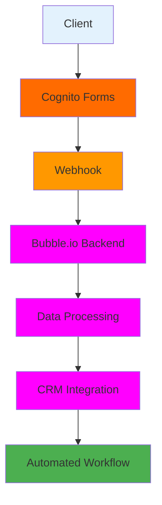

# 🤖 Automation & AI Systems Portfolio – Dondon Longcanaya

A comprehensive portfolio showcasing automation workflows, AI integrations, and SaaS system architectures built with modern low-code platforms and APIs.

---

## 📋 About Me

I'm an Automation & AI Systems Engineer specializing in building intelligent workflow automation systems, AI-powered internal tools, and scalable SaaS integrations. With expertise in event-driven architectures and API-first design, I transform complex business processes into efficient, automated solutions.

**Core Focus Areas:**
- Workflow automation systems using low-code platforms
- AI-powered internal tools and conversational interfaces  
- SaaS integrations connecting multiple business platforms
- API and webhook-based architectures for seamless data flow

---

## 🛠️ Skills & Tools

### 🔄 Automation
- **n8n** - Workflow automation and integration platform
- **Zapier** - Multi-platform automation workflows
- **Make** - Advanced automation scenarios and API integrations

### 🧠 AI / NLP
- **OpenAI** - GPT models for text processing and automation
- **Gemini** - Google's AI for intelligent document processing
- **Dialogflow CX** - Conversational AI and chatbot development

### 🏗️ Platforms
- **Bubble.io** - No-code web application development
- **Cognito Forms** - Advanced form building and data collection
- **Google Workspace** - Suite automation and Apps Script development

### 🔗 Integration
- **REST APIs** - Custom API development and integration
- **Webhooks** - Real-time event-driven data synchronization
- **JSON** - Data structure design and manipulation

---

## �️ System Architecture

---

## 🏷️ Technology Stack

### Frontend

### Automation & Integration

### AI

### Platforms

### Development

---

## 📚 Portfolio Case Studies

### 1. 🔒 Secure Lead Intake Integration
**Overview:** Bubble.io + Cognito Forms integration for secure client intake workflows using webhooks and APIs.

**Tools Used:**
- Bubble.io (Frontend & Backend)
- Cognito Forms (Form Builder)
- Webhooks & APIs (Data Integration)

**Technical Highlights:**
- Real-time form submission processing
- Secure data transmission between platforms
- Automated client onboarding workflows
- Custom API endpoints for data validation

### 2. ⚖️ Automated Legal Billing Engine
**Overview:** Google Apps Script automation pipeline that converts CSV time-tracking exports into client-ready invoices and financial reports.

**Tools Used:**
- Google Apps Script (Automation Engine)
- Google Sheets (Data Processing)
- Google Docs (Document Generation)

**Technical Highlights:**
- CSV parsing and data transformation algorithms
- Automated invoice generation with custom templates
- Financial report aggregation and analysis
- Error handling and data validation systems

### 3. 🤖 AI-Powered Legal Operations Assistant
**Overview:** Google Chat assistant powered by Dialogflow CX, integrated with Bubble Data API and a RAG retrieval layer. The assistant can query both relational client data and company SOPs/policy documents stored in Google Cloud Storage, providing real-time, conversational answers while respecting field-level privacy rules.

**Tools Used:**
- Dialogflow CX (Conversational AI)
- Google Chat (Interface)
- Bubble Data API (Backend Integration)
- RAG (Document Retrieval)
- Google Cloud Storage (Document Storage)

**Technical Highlights:**
- Direct API integration without third-party workflow tools
- Conversational interface to access internal client and policy data
- RAG system for accurate retrieval of SOPs and policies
- Field-level privacy rules to secure sensitive client information
- Real-time data retrieval and context-aware responses

### 4. 🎯 AI Lead Qualification Automation
**Overview:** AI workflow using Cognito Forms, n8n, Gemini, and SendGrid to classify website inquiries, route qualified leads to appropriate teams, and send personalized intake forms via email.

**Tools Used:**
- Cognito Forms (Lead Capture)
- n8n (Workflow Orchestration)
- Gemini AI (AI Classification)
- SendGrid API (Automated Email Delivery)
- Custom APIs (Lead Routing)

**Technical Highlights:**
- AI-powered lead scoring and classification using Gemini
- Multi-channel lead routing automation
- SendGrid API integration for automated intake form delivery
- Real-time qualification workflows
- Performance analytics and optimization

---

## 🏗️ System Design Focus

My approach to building automation systems emphasizes:

**🎯 Event-Driven Workflows**
- Real-time triggers and automated responses
- Scalable event processing architectures
- Minimal latency in data processing

**🔌 API-First Integrations**
- RESTful API design principles
- Comprehensive error handling and retry logic
- Version-controlled API interfaces

**🤖 AI-Assisted Automation**
- Intelligent decision-making at workflow junctions
- Machine learning for process optimization
- Natural language interfaces for complex systems

**🔐 Secure Data Handling**
- End-to-end encryption for sensitive data
- Role-based access control systems
- Compliance with data protection regulations

**📈 Scalable Internal Tooling**
- Modular architecture for easy expansion
- Performance monitoring and optimization
- Cloud-native deployment strategies

---

## 🖥 Portfolio Preview

 

  
  
  

 

---

## 🌐 Portfolio Website

**Live Portfolio:** [Portfolio Website Link Coming Soon]

*Built with React.js, TailwindCSS, and modern web technologies for optimal performance and user experience.*

---

## 📞 Contact

**📧 Email:** don.longcanaya@gmail.com  
**💼 LinkedIn:** [linkedin.com/in/dondonlongcanaya](https://www.linkedin.com/in/dondonlongcanaya/)  
**🐙 GitHub:** [github.com/dondonl](https://github.com/dondonl)

---

## 📝 Notes

This portfolio website was generated with the assistance of Claude AI, combining modern web development practices with AI-assisted design and implementation to create a professional showcase of automation and AI engineering expertise.

---

*🚀 Let's build something amazing together!*
